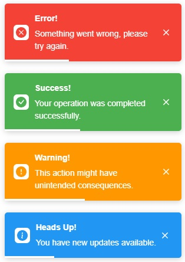

<p align="center">
  
</p>

# Toastify - A Simple and Lightweight Toast Notification Library

Toastify is a super simple, fast, and easy-to-use toast notification library designed to display clean, customizable notifications in your web applications without any unnecessary bloat.

## Key Features:

- **No Dependencies**: No external libraries.
- **Fully Customizable**: You can adjust things like position, duration, icons, and more to fit your app's style.
- **Flexible API**: Easily show different types of toasts (success, error, info, warning).
- **Customizable Styles**: Add your own classes to tweak the look of the toasts however you want.

## Installation:

```sh
npm install @andreasnicolaou/toastify
```

## Usage

```typescript
import { ToastifyManager } from '@andreasnicolaou/toastify';

const toastifyManager = new ToastifyManager('top-right', { closeButton: true, withProgressBar: true });
toastifyManager.error('Error!', 'Something went wrong, please try again.');
toastifyManager.success('Success!', 'Your operation was completed successfully.');
toastifyManager.warning('Warning!', 'This action might have unintended consequences.');
toastifyManager.info('Heads Up!', 'You have new updates available.');
```

## Styling

You have two options for applying styles. 
- Include the default styles.css file from the dist folder in your project.
- Pass a custom class to the ToastifyManager when creating it. Then, based on the class provided customize the toast as per your needs.

## Options

| Option                | Description                                                 | Default Value |
| --------------------- | ----------------------------------------------------------- | ------------- |
| `duration`            | Time in milliseconds for the toast to remain visible. Setting this to 0 will stick the toast forever.       | 3000          |
| `isHtml`              | Whether the message should support HTML.                    | false         |
| `withProgressBar`     | Show a progress bar for the toast.                          | false         |
| `progressBarDuration` | Duration of the progress bar (milliseconds).                | 100           |
| `closeButton`         | Show a close button on the toast.                           | false         |
| `showIcons`           | Show icons for each toast type (error, success, etc.).      | true          |
| `direction`           | Direction of the text (supports `ltr` or `rtl`).            | ltr           |
| `customClasses`       | Custom CSS classes to add to the toast container.           | ""            |
| `maxToasts`           | The maximum number of toasts that can be displayed at once. | 5             |


## Contributing

Contributions are welcome! If you encounter issues or have ideas to enhance the library, feel free to submit an issue or pull request.
