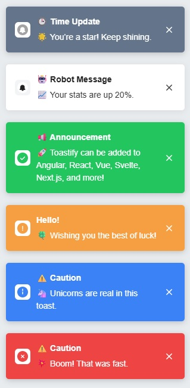

# Toastify – A Simple and Lightweight Toast Notification Library

Toastify is a super simple, fast, and easy-to-use toast notification library for modern web apps. It displays clean, customizable notifications with zero dependencies and supports ESM, CJS, and UMD builds for maximum compatibility.

---

<p align="center">
  
</p>

## Demo

You can try this library live:

👉 <a href="https://stackblitz.com/edit/vitejs-vite-md4bg7fw" target="_blank">Interactive Demo on StackBlitz</a>

🌐 <a href="https://andreasnicolaou.github.io/toastify/" target="_blank">UMD Build Test on GitHub Pages</a>

---


## 

## Key Features

- **No Dependencies** – No external libraries required
- **Modern & Flexible** – ESM, CJS, and UMD builds for all environments
- **Fully Customizable** – Position, duration, icons, themes, stacking, and more
- **Theming** – Light/dark, custom classes, and icon support
- **Tiny & Fast** – Minimal footprint, instant rendering

## Installation

```sh
# npm
npm install @andreasnicolaou/toastify

# yarn
yarn add @andreasnicolaou/toastify

# pnpm
pnpm add @andreasnicolaou/toastify
```

### CDN / Direct Usage

```html
<!-- unpkg CDN (latest version, unminified) -->
<script src="https://unpkg.com/@andreasnicolaou/toastify/dist/index.umd.js"></script>

<!-- unpkg CDN (latest version, minified) -->
<script src="https://unpkg.com/@andreasnicolaou/toastify/dist/index.umd.min.js"></script>

<!-- jsDelivr CDN (un-minified) -->
<script src="https://cdn.jsdelivr.net/npm/@andreasnicolaou/toastify/dist/index.umd.js"></script>

<!-- jsDelivr/unpkg CDN (minified) -->
<script src="https://cdn.jsdelivr.net/npm/@andreasnicolaou/toastify/dist/index.umd.min.js"></script>

<!-- jsDelivr Styles (minified) -->
<link rel="stylesheet" href="https://unpkg.com/@andreasnicolaou/toastify/dist/styles.css" />
<link rel="stylesheet" href="https://cdn.jsdelivr.net/npm/@andreasnicolaou/toastify/dist/styles.css" />
```

**UMD (for `<script>` tags, global `toastify` variable):**

```html
<link rel="stylesheet" href="https://unpkg.com/@andreasnicolaou/toastify/dist/styles.css" />
<script src="https://unpkg.com/@andreasnicolaou/toastify/dist/index.umd.min.js"></script>
<script>
  const manager = new toastify.ToastifyManager('top-right', { closeButton: true });
  manager.success('Hello!', 'Toastify loaded from CDN!');
</script>
```

**ESM (modern bundlers):**

```js
import { ToastifyManager } from '@andreasnicolaou/toastify';
import '@andreasnicolaou/toastify/dist/styles.css';

const manager = new ToastifyManager('top-right', { closeButton: true });
manager.success('Success!', 'Toastify ESM import works!');
```

**CJS (Node/CommonJS):**

```js
const { ToastifyManager } = require('@andreasnicolaou/toastify');
require('@andreasnicolaou/toastify/dist/styles.css');

const manager = new ToastifyManager('top-right', { closeButton: true });
manager.info('Info', 'Toastify CJS import works!');
```

## Quick Usage Example

```js
import { ToastifyManager } from '@andreasnicolaou/toastify';
import '@andreasnicolaou/toastify/dist/styles.css';

const toast = new ToastifyManager('top-right', {
  closeButton: true,
  withProgressBar: true,
  newestOnTop: true,
});

toast.success('Success!', 'Your operation was completed successfully.');
toast.error('Error!', 'Something went wrong, please try again.');
toast.info('Heads Up!', 'You have new updates available.', { closeButton: false });
```

## Styling

- **Default:** Import or link `dist/styles.css` for ready-to-use styles.
- **Custom:** Pass a `customClasses` option to ToastifyManager to add your own classes and override styles as needed.

## API

### Toast Methods

| Function                            | Description               | Options (per toast, overrides manager)                                                                  |
| ----------------------------------- | ------------------------- | ------------------------------------------------------------------------------------------------------- |
| `default(title, message, options?)` | Displays a default toast. | `duration`, `isHtml`, `withProgressBar`, `progressBarDuration`, `closeButton`, `direction`, `showIcons` |
| `light(title, message, options?)`   | Displays a light toast.   | `duration`, `isHtml`, `withProgressBar`, `progressBarDuration`, `closeButton`, `direction`, `showIcons` |
| `error(title, message, options?)`   | Displays an error toast.  | `duration`, `isHtml`, `withProgressBar`, `progressBarDuration`, `closeButton`, `direction`, `showIcons` |
| `success(title, message, options?)` | Displays a success toast. | `duration`, `isHtml`, `withProgressBar`, `progressBarDuration`, `closeButton`, `direction`, `showIcons` |
| `warning(title, message, options?)` | Displays a warning toast. | `duration`, `isHtml`, `withProgressBar`, `progressBarDuration`, `closeButton`, `direction`, `showIcons` |
| `info(title, message, options?)`    | Displays an info toast.   | `duration`, `isHtml`, `withProgressBar`, `progressBarDuration`, `closeButton`, `direction`, `showIcons` |

All options can be set globally on the manager or per-toast (per call).

## Options

| Option                | Description                                                                                           | Default Value |
| --------------------- | ----------------------------------------------------------------------------------------------------- | ------------- |
| `duration`            | Time in milliseconds for the toast to remain visible. Setting this to 0 will stick the toast forever. | 3000          |
| `isHtml`              | Whether the message should support HTML.                                                              | false         |
| `withProgressBar`     | Show a progress bar for the toast.                                                                    | false         |
| `progressBarDuration` | Duration of the progress bar (milliseconds).                                                          | 100           |
| `closeButton`         | Show a close button on the toast.                                                                     | false         |
| `showIcons`           | Show icons for each toast type (error, success, etc.).                                                | true          |
| `direction`           | Direction of the text (`ltr` or `rtl`).                                                               | ltr           |
| `customClasses`       | Custom CSS classes to add to the toast container.                                                     | ""            |
| `maxToasts`           | The maximum number of toasts that can be displayed at once.                                           | 5             |
| `animationType`       | Animation style: `fade`, `slide`, `zoom`, `bounce`, `flip`, `none`.                                   | fade          |
| `tapToDismiss`        | Dismiss toast on click/tap.                                                                           | false         |
| `newestOnTop`         | Stack newest toasts on top (`true`) or bottom (`false`).                                              | false         |

### Theming & Customization

- Use the `customClasses` option to add your own classes for custom themes.
- Use the built-in `light` type for a light toast theme: `toast.light('Title', 'Message')`.

---

## Contributing

Contributions are welcome! If you encounter issues or have ideas to enhance the library, feel free to submit an issue or pull request.
